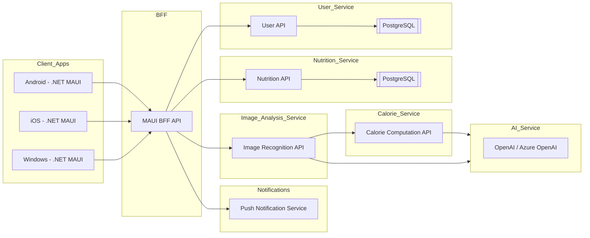

# AI Calorie Counter - Architecture Documentation

## Overview

### Objective:
AI Calorie Counter is a cross-platform mobile and desktop application built using **C#** and **.NET MAUI**. It targets **Android, iOS, and Windows** platforms to provide an AI-powered calorie and nutrition tracker similar to "FoodCalAI". The app leverages advanced AI/ML technologies, intuitive UI/UX design, and robust backend services to deliver seamless user experiences.

### ✨ Core Technologies

---

## High-Level Architecture

### Key Design Patterns:
- **MVVM** (Model-View-ViewModel) for separation of concerns and maintainable code.
- **Dependency Injection** for service provisioning.
- **Async/Await** for non-blocking operations.
- **Responsive Design** for mobile and desktop compatibility.

## 🏗️ System Architecture

---
## ⚙️ Service Descriptions

Each microservice has a single, well-defined responsibility within the system.

### MAUI BFF API (Backend for Frontend)
- Role: The orchestrator and single entry point for the .NET MAUI application.

- Description: This service acts as a secure facade between the mobile app and the backend microservices. It simplifies the client by receiving requests, forwarding them to the appropriate services, and aggregating their responses into an optimized format.

### User Service
- Role: The identity and profile manager.

- Description: This service is dedicated to user management. It handles account registration, authentication (login), profile information (name, goals, etc.), and overall account security.

### Nutrition Service
- Role: The application's nutritional encyclopedia.

- Description: This service contains and exposes a vast database of food items and their detailed nutritional information (calories, protein, etc.). It is queried whenever nutritional data is needed for a specific ingredient.

### Image Analysis Service
- Role: The "eyes" of the application.

- Description: Its sole responsibility is to process meal images sent by users. It leverages the external AI Service to identify food items in a picture and returns a structured list of what it recognized.

### Calorie Computation Service
- Role: The calculator and logbook.

- Description: This service takes a list of food items, queries the Nutrition Service for data, calculates the total nutritional value, and logs the final meal into the user's daily consumption history.

### Push Notification Service
- Role: The application's messenger.

- Description: Manages and sends push notifications to the user's device to provide reminders, motivational messages, and other timely communications.

### AI Service (OpenAI / Azure OpenAI)
- Role: The external, specialized artificial intelligence "brain".

- Description: This is a third-party service consumed by the backend, primarily by the Image Analysis Service. It provides the advanced visual recognition capabilities needed to identify food from a photo.

---
