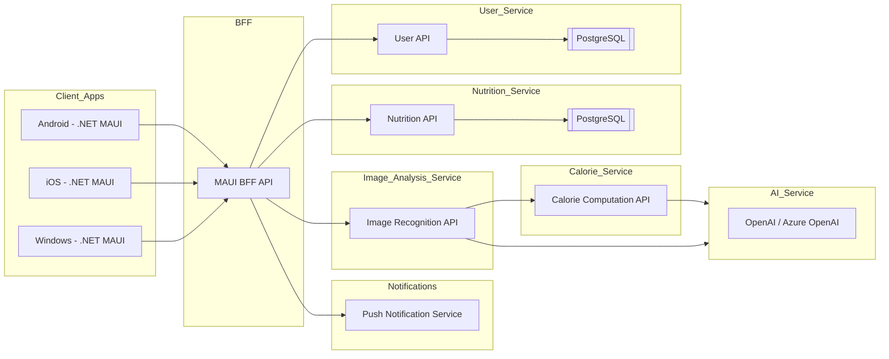

# AI Calorie Counter - Architecture Documentation

## Overview

### Objective:
AI Calorie Counter is a cross-platform mobile and desktop application built using **C#** and **.NET MAUI**. It targets **Android, iOS, and Windows** platforms to provide an AI-powered calorie and nutrition tracker similar to "FoodCalAI". The app leverages advanced AI/ML technologies, intuitive UI/UX design, and robust backend services to deliver seamless user experiences.

---

## High-Level Architecture

### Key Design Patterns:
- **MVVM** (Model-View-ViewModel) for separation of concerns and maintainable code.
- **Dependency Injection** for service provisioning.
- **Async/Await** for non-blocking operations.
- **Responsive Design** for mobile and desktop compatibility.

### Architecture Diagram:



---

## Folder Structure

Below is the recommended folder structure for the application to ensure clean maintainability:

```
/src
  /AI_Calorie_Counter
    /Views
      - HomePage.xaml
      - LogMealPage.xaml
      - ProfilePage.xaml
      - SettingsPage.xaml
    /ViewModels
      - HomeViewModel.cs
      - LogMealViewModel.cs
      - ProfileViewModel.cs
      - SettingsViewModel.cs
    /Services
      - IAiRecognitionService.cs
      - IDataSyncService.cs
      - BarcodeScanningService.cs
    /Models
      - UserProfile.cs
      - FoodLog.cs
      - Goal.cs
    /Database
      - AppDbContext.cs
      - Migrations/
    /Utils
      - Localization/
        - Resources.resx
        - Resources.fr.resx
      - Extensions/
      - Converters/
```

---
